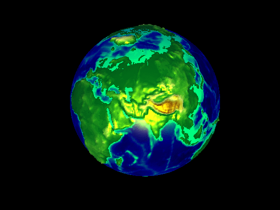
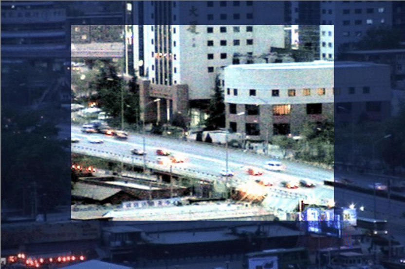
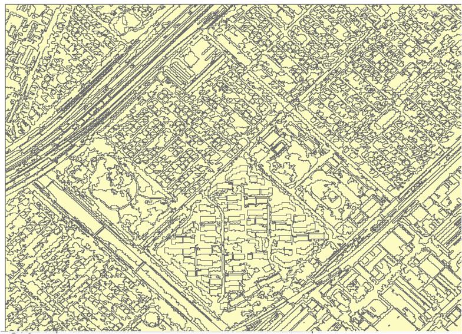
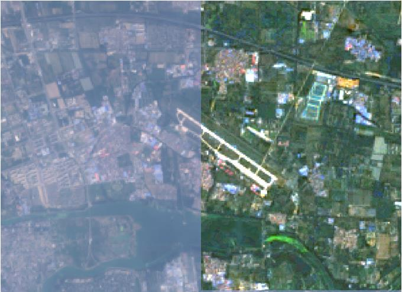
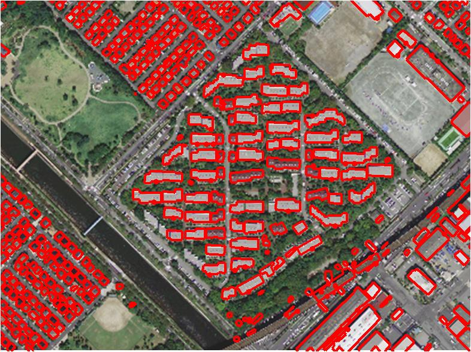
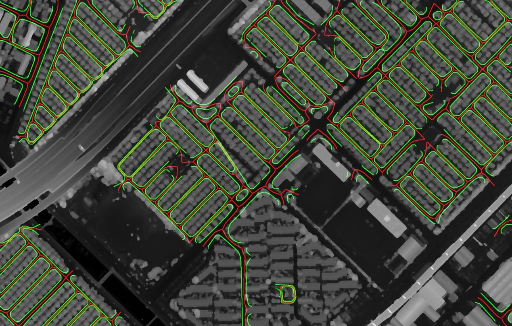

# liyan1123.github.io
<h3> This is a site for image processing and pattern recognition.</h3>

<h3> -Image enhancement </h3>

<h3> -Image segmentation </h3>

<h3> -Atmospheric correction </h3>

<h3> -AOD retrieval </h3>

<h3> -Building extraction and modeling </h3>

<h3> -Road extraction and modeling </h3>

Contact and support
lily-hust@163.com
